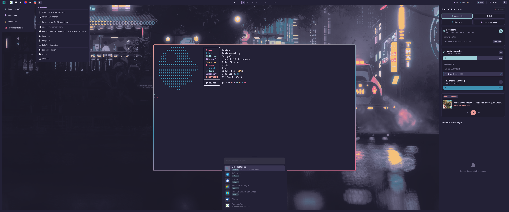
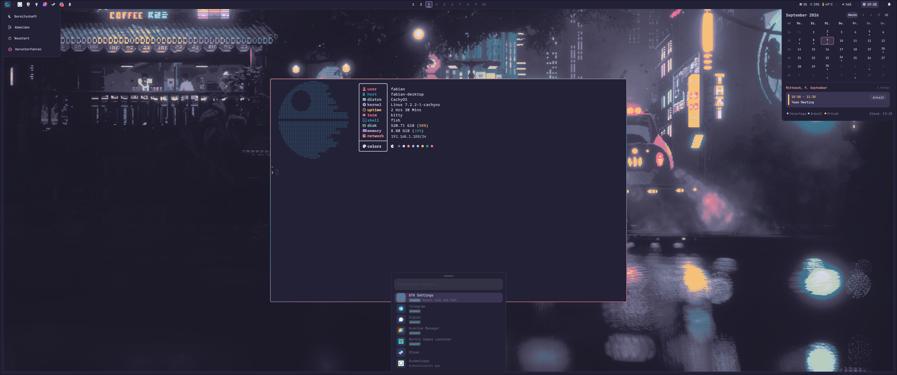

# Quickshell Desktop-Konfiguration

[English](README.md) | [Deutsch](README.de.md)





Desktop-Shell-Setup für Hyprland auf Basis von [Quickshell](https://quickshell.outfoxxed.me/) mit dynamischem Theming (Rosé Pine Moon als Standardpalette, neben Tokyo Night und Catppuccin Mocha). Bietet organisch morphende Menüs und Panels mit konkaven Eckenübergängen, nativen PipeWire-Audio-Umschalter, MPRIS-Mediensteuerung, Benachrichtigungs-Daemon, interaktiven Monatskalender und System-Tray mit DBusMenu-Unterstützung.

---

## High-Level Funktionsübersicht

Diese Shell dient als zentrale Desktop-Umgebung für Hyprland und ersetzt mehrere eigenständige Hintergrund-Dienste und Leisten durch einen einzigen, ressourcenschonenden Qt 6/QML-Prozess.

### Was die Shell bietet

1. **TopBar:**
   - 34px hohe Leiste mit automatischer Platzreservierung (exclusive zone).
   - 10 Workspaces mit Fensterstatus und aktiver Unterstreichung.
   - Live-Hardwareüberwachung: CPU-Auslastung (`/proc/stat`), RAM-Verbrauch (`/proc/meminfo`) und CPU-Temperatur (`sensors`).
   - PipeWire Lautstärke-Widget mit Anzeige des Ausgabegerätenamens und Scroll-Funktion.
   - Uhrzeit mit Wochentag; Klick öffnet das Kalender-Dropdown.
   - Benachrichtigungs-Taste mit Zähler für ungelesene Meldungen und Nicht-Stören-Status (DND).
   - Distributions-Symbol zum Umschalten des Power-Menüs.

2. **Themed System-Tray:**
   - DBus StatusNotifierItem (SNI) Integration für Hintergrundanwendungen (Steam, Heroic, KeePassXC, Bluetooth etc.).
   - Ersetzt native, unstylbare Qt-Menüs durch dynamisch gestaltete QML-Menüs in der aktiven Themenpalette (Standard: Rosé Pine Moon).
   - Nahtloser Übergang aus der Leiste mit konkaven Kurven, verankert am aktiven Icon.
   - Transparente Klick-Maske auf der Leiste: Andere Tray-Icons bleiben bei geöffnetem Menü voll ansprech- und klickbar.
   - Verschachtelte Untermenüs, Checkboxen, Trennstriche und dynamische Breitenberechnung.

3. **Kontrollzentrum & Benachrichtigungs-Daemon:**
   - Vollwertiger DBus `org.freedesktop.Notifications` Server. Ersetzt externe Notification-Daemons.
   - Interaktive Toast-Popups oben rechts mit Aktions-Buttons und Pausieren bei Maus-Hover.
   - Ausfahrbares Seitenpanel von der rechten Bildschirmkante mit konkavem Ecken-Morphing.
   - Schnellschalter-Raster (2x2): Bluetooth-Manager, Nicht Stören, Mikrofon-Stummschaltung und Theme-Switcher.
   - Integrierter Bluetooth-Manager: Adapter ein/aus, Gerätesuche und 1-Klick-Verbindung.
   - Audio-Ausgabe-Umschalter: Direkte Auswahl des aktiven PipeWire-Sinks ohne Zusatztools.
   - Mikrofon-Steuerung: Schieberegler für Eingangspegel und Mute-Schalter.
   - MPRIS-Player: Cover-Art, Songtitel, Interpret, Seekbar (`mm:ss`) und Mediensteuerung.
   - Benachrichtigungshistorie mit Einzel- und Gesamtlöschung.

4. **Interaktiver Kalender & Agenda:**
   - Monatsansicht im 42-Tage-Raster mit ISO 8601 Kalenderwochen (KW 1-53).
   - Heutiger und ausgewählter Tag hervorgehoben; Punkte an Tagen mit Terminen.
   - Terminliste mit Startzeit, Zusammenfassung und farbigem Kalender-Badge.
   - Python-Daemon im Hintergrund zum Abrufen von `.ics`-Feeds aus Google Calendar oder Nextcloud.
   - Sichere Keyring-Anbindung über KeePassXC oder `secret-tool` verhindert offene Token in Git.

5. **Lautstärke- & Mute-OSD:**
   - Zentriertes Pill-Overlay am unteren Bildschirmrand.
   - Reagiert über PipeWire automatisch auf Hotkeys, `wpctl` und Mausrad an der Bar.
   - Zeigt Lautstärke-Prozentwert, dynamisches Audio-Icon und animierten Balken.
   - Klickdurchlässig (`mask: Region { item: null }`), blockiert keine Fenster oder Mausklicks.

6. **Power-Menü:**
   - Fährt oben links ein und schließt über konkave Kurven bündig an Leiste und Rand an.
   - Optionen für Bereitschaft (`systemctl suspend`), Abmelden, Neustart und Herunterfahren (`hyprshutdown`).
   - Vollständig per Tastatur steuerbar; Schließen mit Escape.

7. **App-Launcher:**
   - Unten zentriertes Suchmenü für Desktop-Anwendungen mit Icons und Echtzeitsuche.

8. **Bildschirmränder & Konkave Ecken:**
   - 12px Ränder unten, links und rechts.
   - 4 konkave Ecken verbinden die Außenleisten fließend mit den Hyprland-Fenstern.

### Ersetzte externe Programme

Diese Shell macht folgende separate Werkzeuge überflüssig:
- `waybar` oder `polybar` (Statusleiste)
- `swaync`, `dunst` oder `mako` (Benachrichtigungs-Daemon und Kontrollzentrum)
- `swayosd`, `avizo` oder `wob` (Lautstärke-OSD)
- `wlogout` oder Power-Skripte (Energie-Menü)
- `rofi` oder `wofi` (App-Launcher)
- `blueman-applet` oder `blueman-manager` (Bluetooth-Verwaltung)
- `pavucontrol` oder `pwvucontrol` für den alltäglichen Gerätewechsel

---

## Installation und Einrichtung

### 1. Voraussetzungen und Abhängigkeiten

Installiere die benötigten Pakete auf deinem System (Paketnamen für Arch Linux / CachyOS):

- **Shell Engine:** `quickshell` (oder `quickshell-git`)
- **Qt 6 Module:** `qt6-base`, `qt6-declarative`, `qt6-svg`
- **Audio & Medien:** `pipewire`, `wireplumber`, `libpipewire`, `pactl` (aus `libpulse`)
- **Secret Service (für Kalender):** `libsecret` (stellt `secret-tool` bereit) und ein Secret-Service-Provider wie `keepassxc`
- **Schriften & Icons:** `ttf-jetbrains-mono-nerd`, `rose-pine-moon-icons` (oder beliebige Nerd Font / Icon-Themes)
- **Optional / Empfohlen:** `bluez`, `bluez-utils`, `lm_sensors`, `grim`

### 2. Repository klonen

Klone das Repository in dein Konfigurationsverzeichnis:

```bash
git clone https://github.com/fbuedding/quickshell.git ~/.config/quickshell
```

Der Haupteinstiegspunkt liegt unter `~/.config/quickshell/default/shell.qml`.

### 3. Notwendige und empfohlene Anpassungen

Passe vor dem ersten Start folgende Stellen an deine Hardware und dein System an:

1. **Distributions-Logo in der TopBar (`default/bar/Bar.qml`):**
   - Die linke Taste sucht standardmäßig nach `/usr/share/icons/cachyos.svg`.
   - Bei Arch, Fedora oder anderen Distributionen: Passe den Pfad zu deinem Distro-SVG an oder verwende ein Nerd-Font-Icon.

2. **Eckenrundung und Maße (`default/theme/Theme.qml`):**
   - `rounding: 5` sollte mit deiner Hyprland-Einstellung `decoration.rounding` übereinstimmen.
   - `barHeight: 34` und `borderThickness: 12` steuern Leistenhöhe und Bildschirmränder.

3. **Audio Soft-Mixer (WirePlumber):**
   - Falls dein Monitor (z. B. über DisplayPort / HDMI) keine Hardware-Stummschaltung unterstützt, erstelle `~/.config/wireplumber/wireplumber.conf.d/50-alsa-soft-mixer.conf`:
     ```spa-json
     monitor.alsa.rules = [
       {
         matches = [ { node.name = "~alsa_output.*" } ]
         actions = { update-props = { api.alsa.soft-mixer = true } }
       }
     ]
     ```

4. **Qt 6 Icon-Theme (`~/.config/qt6ct/qt6ct.conf`):**
   - Setze `icon_theme=rose-pine-moon-icons` (oder dein bevorzugtes Icon-Theme), damit Tray- und App-Icons passend zur Standardpalette Rosé Pine Moon aufgelöst werden.

---

## Kalender-Konfiguration und Secrets

Das Kalender-Dropdown liest iCal-Feeds (`.ics`) von Google Calendar, Nextcloud oder beliebigen iCalendar-URLs. Um zu verhindern, dass private URLs und Zugriffs-Token in Git landen, sind Konfiguration und Geheimnisse entkoppelt.

### 1. Kalender-Konfiguration anlegen

Kopiere die Beispiel-Konfiguration:

```bash
cp ~/.config/quickshell/default/calendar/calendars.example.json ~/.config/quickshell/default/calendar/calendars.json
```

`default/calendar/calendars.json` wird von Git ignoriert. Passe die Liste an deine Kalender an:

```json
[
  {
    "name": "Feiertage",
    "url": "https://calendar.google.com/calendar/ical/de.german%23holiday%40group.v.calendar.google.com/public/basic.ics",
    "color": "#c4a7e7",
    "enabled": true
  },
  {
    "name": "Arbeit",
    "keyring": "google-calendar-work",
    "color": "#9ccfd8",
    "enabled": true
  },
  {
    "name": "Privat",
    "keyring": "google-calendar-private",
    "color": "#eb6f92",
    "enabled": true
  }
]
```

- Öffentliche Feeds: Direkte `url` angeben.
- Private Feeds: `url` weglassen und `keyring` mit einem Bezeichner setzen (z. B. `google-calendar-work`).

### 2. Secrets im Keyring / KeePassXC hinterlegen

Wähle eine der folgenden Methoden zur Speicherung der privaten `.ics`-URLs:

#### Option A: KeePassXC (Empfohlen)
1. In den KeePassXC-Einstellungen die **Secret-Service-Integration** aktivieren.
2. Einen Eintrag in der Datenbank anlegen:
   - **Titel:** Muss exakt dem `keyring`-Namen aus `calendars.json` entsprechen (z. B. `google-calendar-work`).
   - **Passwort** oder **URL:** Die geheime Google-Calendar iCal-URL einfügen (endet auf `.ics`).
3. Beim Start fragt der Kalender-Daemon das Secret einmalig pro Login-Sitzung ab und cacht es im flüchtigen Arbeitsspeicher (`$XDG_RUNTIME_DIR/quickshell/`, tmpfs) mit Rechten 0600. Nachfolgende Abfragen laufen ohne Passwort-Prompt.

#### Option B: Terminal via `secret-tool`
Speichere das Secret direkt in den FreeDesktop Secret Service Keyring:

```bash
secret-tool store --label="Google Calendar Arbeit" Title google-calendar-work
# Bei Aufforderung die private .ics URL eingeben
```

Abfrage testen:

```bash
secret-tool lookup Title google-calendar-work
```

#### Option C: Lokale Overrides-Datei
Erstelle `~/.config/quickshell/default/calendar/calendars.local.json` (wird von Git ignoriert):

```json
{
  "Arbeit": "https://calendar.google.com/calendar/ical/<privates-token>/basic.ics",
  "Privat": "https://calendar.google.com/calendar/ical/<privates-token>/basic.ics"
}
```

---

## Lokalisierung (i18n)

Die Shell passt sich automatisch an deine Systemsprache an (`Qt.locale().name` / `$LANG`). Aktuell sind Englisch (`en`) und Deutsch (`de`) enthalten.

### Sprache manuell vorgeben
Um unabhängig vom System eine bestimmte Sprache zu erzwingen, starte Quickshell mit der Umgebungsvariable `QS_LANG`:

```bash
QS_LANG=en quickshell -d
```

### Neue Sprache hinzufügen
So fügst du eine weitere Sprache hinzu (z. B. Französisch `fr`, Spanisch `es`, Italienisch `it`):
1. Öffne `default/i18n/I18n.qml`.
2. Dupliziere den `"en"`-Block in der `locales`-Eigenschaft.
3. Benenne den Schlüssel nach deinem Sprachcode (z. B. `"fr"`).
4. Übersetze die Textwerte. Fehlende Einträge fallen automatisch auf Englisch zurück.
5. Monatsnamen und Wochentage werden über `Qt.locale()` automatisch übersetzt.

### Uhrzeit- und Datumsformate
Format-Strings werden automatisch durch die aktive Sprache mit sinnvollen Standards belegt:
- **Deutsch (`de`):** 24-Stunden-Uhr (`HH:mm`, z. B. `18:30`), Kalendertag mit Tag vor Monat (`dddd, d. MMMM`).
- **Englisch (`en`):** 12-Stunden-Uhr mit AM/PM (`h:mm AP`, z. B. `6:30 PM`), Kalendertag mit Monat vor Tag (`dddd, MMMM d`).

Falls gewünscht, können Formate pro Sprache in `default/i18n/I18n.qml` angepasst oder global überschrieben werden:
```bash
QS_CLOCK_FORMAT="HH:mm:ss" QS_DATE_FORMAT="ddd, d. MMM" quickshell -d
```
Oder direkt in `default/i18n/I18n.qml` (`clockFormatOverride: "HH:mm:ss"`).

---

## Theme-System und Theme-Switcher

Die Shell unterstützt dynamisches Theme-Switching zur Laufzeit über alle Komponenten hinweg ohne Quickshell-Neustart.

### Enthaltene Themes
- `rose-pine-moon` (Rosé Pine Moon - Standard)
- `tokyo-night` (Tokyo Night)
- `catppuccin-mocha` (Catppuccin Mocha)

### Theme wechseln
- **Kontrollzentrum:** Klick auf den Theme-Button im Schnelleinstellungen-Raster (2x2) des Benachrichtigungs-Panels.
- **Quickshell IPC:**
  ```bash
  qs ipc call theme next                # Zum nächsten Theme wechseln
  qs ipc call theme set tokyo-night     # Direkt zu einem Theme wechseln
  qs ipc call theme current             # Aktiven Theme-Schlüssel ausgeben
  qs ipc call theme list                # Verfügbare Themes auflisten
  ```
- **Hyprland Tastenkürzel:**
  ```ini
  bind = SUPER, T, exec, qs ipc call theme next
  ```

### Zustand-Persistenz
Das aktive Theme wird automatisch in `~/.config/quickshell/current_theme` gespeichert und beim Start wiederhergestellt.

### Externer Hook-Mechanismus (`on_theme_change.sh`)
Externe Programme (wie Hyprland-Fensterrahmen, Terminals oder Wallpaper-Daemons) können über ein Hook-Skript auf Theme-Änderungen reagieren:
1. Beispielskript kopieren:
   ```bash
   cp ~/.config/quickshell/default/scripts/on_theme_change.sh.example ~/.config/quickshell/on_theme_change.sh
   chmod +x ~/.config/quickshell/on_theme_change.sh
   ```
2. Bei jedem Theme-Wechsel führt Quickshell `~/.config/quickshell/on_theme_change.sh <theme-name>` aus.
3. Das mitgelieferte Beispiel aktualisiert automatisch die aktiven Rahmenfarben in Hyprland (`hyprctl keyword general:col.active_border`). Externe Tools können `~/.config/quickshell/current_theme` alternativ auch über `inotifywait` oder systemd-Path-Units überwachen.

### Wichtige Hinweise und Integration (Gotchas)
- **Fensterrahmen:** Rahmenfarben werden von Hyprland verwaltet, nicht von Quickshell. Nutze `on_theme_change.sh`, damit Hyprlands aktive Rahmenfarben synchron mit der Shell wechseln.
- **Icon-Themes und GTK/Qt-Apps:** System-Tray- und App-Launcher-Icons richten sich nach dem installierten System-Icon-Theme (z. B. `rose-pine-moon-icons` oder `Papirus`). Das Umschalten der Shell-Palette passt die Oberfläche der Shell an, ändert jedoch nicht die Theme-Konfiguration eigenständiger GTK/Qt-Programme, es sei denn, dies wird in `on_theme_change.sh` skriptbasiert ausgelöst.
- **Eigene Themes hinzufügen:** Öffne `default/theme/Colors.qml`, trage den Namen in `availableThemes` ein und definiere die Farbpalette im `themes`-Dictionary.

---

## Hyprland-Integration

### 1. Klassische Syntax (`~/.config/hypr/hyprland.conf`)

Füge folgende Zeilen in deine `hyprland.conf` ein:

```ini
# Autostart des Quickshell-Daemons
exec-once = quickshell -d
exec-once = keepassxc
exec-once = systemctl --user start hyprpolkitagent

# Synchronisation der Eckenrundung
decoration {
    rounding = 5
}

# Tastenkombinationen für Quickshell IPC
bind = SUPER, R, exec, qs ipc call applauncher toggle
bind = SUPER, Escape, exec, qs ipc call powermenu toggle
bind = SUPER, I, exec, qs ipc call notifications toggle
bind = SUPER, C, exec, qs ipc call calendar toggle
bind = SUPER, T, exec, qs ipc call theme next

# Animationen auf statischen Rand-Overlays deaktivieren
layerrule = noanim, quickshell-corners
```

### 2. Moderne Lua-Syntax (`~/.config/hypr/hyprland.lua`, Hyprland 0.55+)

Falls du das Lua-Konfigurationsformat verwendest:

```lua
-- Autostart
hl.on("hyprland.start", function()
    hl.exec_cmd("quickshell -d & keepassxc")
    hl.exec_cmd("systemctl --user start hyprpolkitagent")
end)

-- Tastenkombinationen
local launcher = "qs ipc call applauncher toggle"
local powerMenu = "qs ipc call powermenu toggle"
local controlCenter = "qs ipc call notifications toggle"
local calendar = "qs ipc call calendar toggle"
local themeNext = "qs ipc call theme next"

hl.bind(mainMod .. " + " .. "R", hl.dsp.exec_cmd(launcher))
hl.bind(mainMod .. " + " .. "Escape", hl.dsp.exec_cmd(powerMenu))
hl.bind(mainMod .. " + " .. "I", hl.dsp.exec_cmd(controlCenter))
hl.bind(mainMod .. " + " .. "C", hl.dsp.exec_cmd(calendar))
hl.bind(mainMod .. " + " .. "T", hl.dsp.exec_cmd(themeNext))

-- Eckenrundung synchronisieren
hl.config({
    decoration = {
        rounding = 5,
        rounding_power = 1,
    },
})
```

---

## Verzeichnisstruktur

```text
~/.config/quickshell/
├── default/
│   ├── shell.qml                # Haupteinstiegspunkt (ShellRoot)
│   ├── Border.qml               # 12px Ränder und 4 konkave Innenecken
│   ├── bar/
│   │   ├── Bar.qml              # 34px TopBar
│   │   ├── Workspaces.qml       # 10 Workspaces mit aktiver Unterstreichung
│   │   ├── SysInfo.qml          # CPU, RAM und Temperaturüberwachung
│   │   ├── Volume.qml           # PipeWire Lautstärke-Widget
│   │   ├── Clock.qml            # Uhrzeit und Datum (Klick öffnet Kalender)
│   │   ├── Tray.qml             # System-Tray (DBus StatusNotifierItem)
│   │   ├── NotificationButton.qml # Glocken-Icon mit Unread-Badge und DND
│   │   └── Separator.qml        # Trennelemente
│   ├── tray/
│   │   ├── TrayMenu.qml         # Themed Tray-Menü mit Morphen und Submenüs
│   │   ├── TrayMenuState.qml    # Singleton für Tray-Status und Position
│   │   └── qmldir               # QML-Modulregistrierung
│   ├── calendar/
│   │   ├── CalendarDropdown.qml # Monatskalender und Termin-Agenda
│   │   ├── CalendarState.qml    # Kalender-Status und Sync-Verwaltung
│   │   ├── calendars.example.json # Neutrale Konfigurationsvorlage
│   │   ├── calendars.json       # Lokale Kalenderliste (gitignored)
│   │   └── qmldir               # QML-Modulregistrierung
│   ├── notifications/
│   │   ├── NotificationState.qml # DBus Notification-Server Daemon
│   │   ├── NotificationPanel.qml # Slide-in Kontrollzentrum (MPRIS, Toggles, Historie)
│   │   ├── NotificationPopup.qml # Toast-Popups oben rechts
│   │   ├── NotificationCard.qml  # Benachrichtigungskarte mit Aktionen
│   │   ├── MprisPlayerWidget.qml # MPRIS-Player mit Artwork und Seekbar
│   │   ├── AudioControlWidget.qml # PipeWire Sink-Switcher und Mic-Steuerung
│   │   ├── BluetoothWidget.qml  # Bluetooth Schnellschalter und Gerätemanager
│   │   └── qmldir               # QML-Modulregistrierung
│   ├── power_menu/
│   │   ├── PowerMenu.qml        # Energie-Menü (oben links, slide-in)
│   │   ├── PowerMenuState.qml   # Power-Menü Singleton
│   │   └── qmldir               # QML-Modulregistrierung
│   ├── app_launcher/
│   │   ├── AppLauncher.qml      # App-Launcher (unten zentriert, slide-up)
│   │   ├── AppLauncherState.qml # App-Launcher Singleton
│   │   └── qmldir               # QML-Modulregistrierung
│   ├── osd/
│   │   ├── OsdState.qml         # PipeWire Lautstärke-Listener
│   │   ├── VolumeOsd.qml        # Zentriertes Pill-OSD für Lautstärke und Mute
│   │   └── qmldir               # QML-Modulregistrierung
│   ├── components/
│   │   └── ConcaveCurves.qml    # ShapePath-Komponente für konkave Rundungen
│   ├── theme/
│   │   ├── Colors.qml           # Theme-Paletten und Switcher-Logik
│   │   ├── Theme.qml            # Maße, Eckenradien und Rahmen
│   │   └── qmldir               # Theme-Singleton-Registrierung
│   └── scripts/
│       ├── cycle_audio.py       # Audio-Sink Durchwechsel-Skript (Mittelklick)
│       ├── fetch_calendar.py    # iCal-Parser und Cache-Daemon
│       └── on_theme_change.sh.example # Beispiel-Hook-Skript für Theme-Wechsel
├── README.md                    # Englische Dokumentation
└── README.de.md                 # Deutsche Dokumentation
```

---

## Nützliche Befehle

```bash
# Quickshell als Hintergrund-Daemon starten
quickshell -d

# Laufende Instanzen anzeigen
quickshell list

# Live-Logs ansehen
quickshell log -f

# IPC Aufrufe
qs ipc call powermenu toggle
qs ipc call applauncher toggle
qs ipc call notifications toggle
qs ipc call notifications toggleDnd
qs ipc call notifications dismissAll
qs ipc call calendar toggle
qs ipc call calendar today
qs ipc call osd show

# Theme-Umschaltung
qs ipc call theme next
qs ipc call theme set tokyo-night
qs ipc call theme current
qs ipc call theme list

# Flüchtigen Kalender-Secrets-Cache im RAM leeren
python3 ~/.config/quickshell/default/scripts/fetch_calendar.py --clear-session-secrets
```

---

## Danksagung und Referenzen

Diese Konfiguration basiert auf und ist inspiriert von:
- [Caelestia shell rebuild tutorial](https://github.com/kartik317/Caelestia_shell_rebuild_tutorial) von kartik317 (diente als ursprüngliche Codebasis)
- [Caelestia Shell](https://github.com/caelestia-dots/shell) (ursprüngliches Design-Konzept, organische Rundungen und Desktop-Layout)
- Entwickelt primär mit KI-Unterstützung für Code-Generierung, Refactoring und Layout-Architektur, iterativ auf Hyprland getestet und verfeinert
